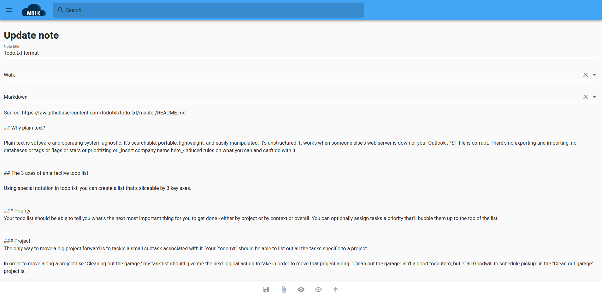

<h1 align="center">
   
   
   
</h1>

  
  

  

<h2>Overview</h2>

Welcome to the repository of Wolk. Wolk is a minimalistic piece of note taking software written in .NET Core and Vue + Vuetify.

- **Minimalistic web interface.** Wolk contains a minimalistic web interface where you can manage your daily note taking needs.
- **Simple API.** Wolk contains an API for you to automate nearly everything.
- **Todo.txt integration.** Wolk has integration for [todo.txt](http://todotxt.org/). This is a very simple, text based syntax to manage your todo items.
- **Sticky notes.** You can create a note of type "Sticky note" so you can create a whiteboard on your screen.
- **Progressive web app.** You can install the PWA on your phone and everything should work just fine.

I built Wolk with the idea of becoming more proficient with .NET Core and Vue. Overtime, it gained more functionalities and I started using it for my day-to-day use and am pretty satisfied with it.

<h2>Docs</h2>

- [Installation](docs/install.md)
- [User manual](docs/user-manual.md)
- [API](docs/api.md)
- [Configuration](docs/configuration.md)