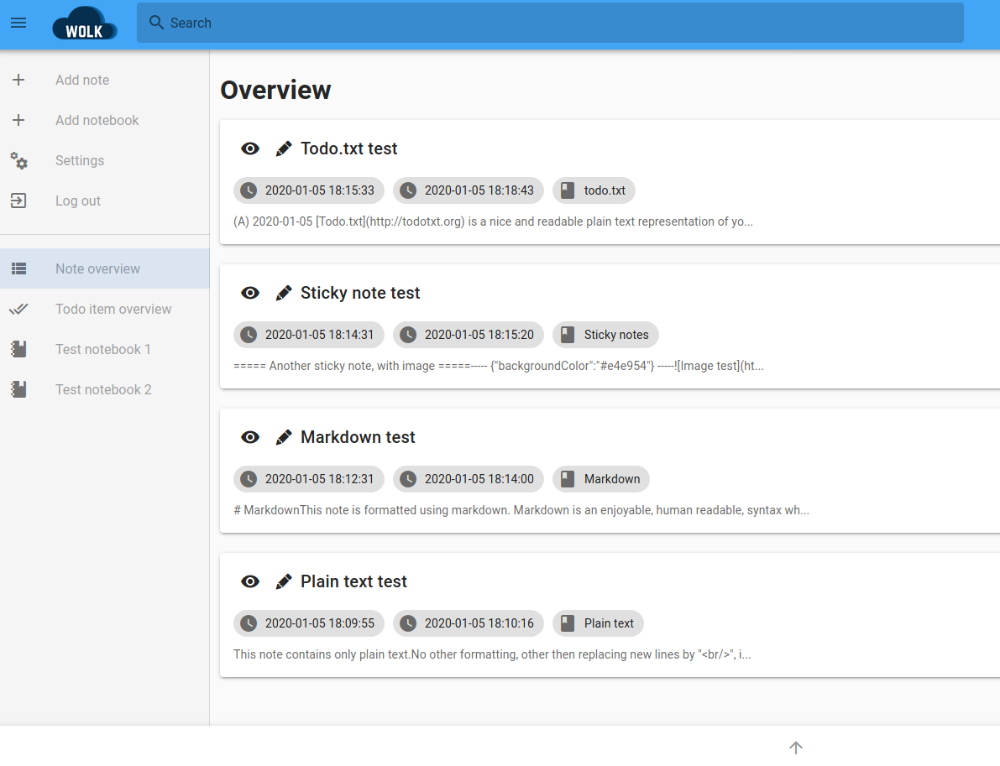
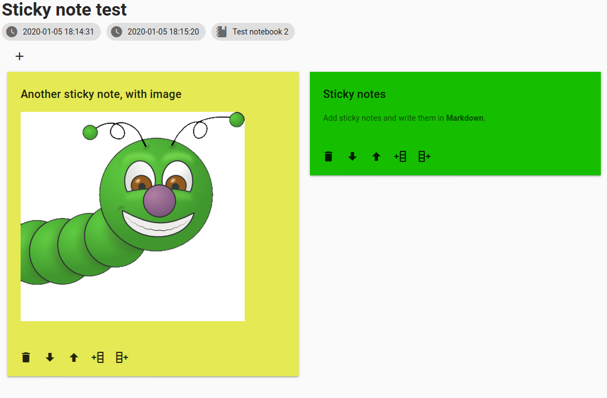

# User manual

This page contains the user manual for the user interface of Wolk. For quickly spinning up a local test setup for Wolk, see [installation](install.md).

## Log in

When you go to Wolk, the first thing you need to do is log in.


You log in by providing your email address and your password (given you have a valid account, see [configuration](configuration.md) for more information).

## Navigating through Wolk



When you are logged in, you will be greeted by this screen. At the left side above the divider, you see the options for creating a new note, a new notebook, settings and logging out. Below the divider, you see all created notebooks and links for showing all notes and for showing all todo.txt items.

When clicking the eye on a note, you can view the specific note. Clicking the pen lets you edit the note.

The bar on the bottom contains all "context" buttons. In this case, only the "To top" button is shown.

## Creating / updating a note


When creating or updating a note, the form above is shown. You can fill in a title, in which notebook the note should be added, the note type (more on this later) and the actual note contents. This specific note is written using Markdown, a simple, human readable, markup language which parses to HTML. A good cheat sheet for Markdown can be found [here](https://github.com/adam-p/markdown-here/wiki/Markdown-Cheatsheet). The context menu contains buttons for saving the note, adding attachments, viewing the note, previewing the note and going back to the top of the page.

## Adding attachments

When editing / viewing a note, you see a paperclip button in the context menu at the bottom of the page. When clicking this button, a dialog will open that shows all currently added attachments and a button to upload a new attachment.


Clicking the green button lets you select a file to upload. Clicking the attachment text lets you download the attachment to your device. Clicking the trash can lets you delete the note.

Clicking the link item creates a link that you can insert into your note. When you click this button, a green message will appear and clicking this message will copy the attachment link to your clipboard. You can now paste this link into the note.


## Sticky notes

Creating a note with note type "Sticky notes" lets you add sticky notes to a note.


When viewing the note, you can now add / delete / rearrange sticky notes.



Clicking the trash can icon lets you delete the sticky note. Clicking the arrow down or up will move the sticky note one position lower or higher. Clicking the button with the plus on the left or plus on the right will create a new sticky note on the left or right.

Clicking the plus button at the top left will create a new sticky note at the front.

Clicking the sticky note lets you edit the sticky note content. The sticky note contents can be written using Markdown. You can also select a background color for the sticky note.


## Todo.txt

A note taking application is not complete without a way to efficiently capture todo items. For this purpose, I've built [todo.txt](http://todotxt.org/) in Wolk. Todo.txt is a simple, plain text format for specifying your todo items. When creating a new note with type "todo.txt", you can manage your todo.txt items in that note.


When clicking on a todo item, you can edit the selected item. You can choose to edit the raw todo.txt item (which is simple enough). The floppy icon lets you save your changes, the check icon lets you complete this item, the trash can icon lets you delete the item and the last item lets you cancel the changes.


You can specify a due date at the end of a todo item in this format: `due:2020-01-31`. When the due date gets near or the note is overdue, the note will be placed on top of the list without regard of the priority of other notes. The todo item will also get a color whenever the due date is approaching or the item is overdue.


You can choose to edit the todo list manually. By clicking the pen icon in the context bar on the bottom, you can edit the plain text version of the todo.txt note. The following note contents lead to the todo items as shown in the screenshot:

```
(A) 2020-01-05 [Todo.txt](http://todotxt.org) is a nice and readable plain text representation of your todo list. +todotxt @note
(A) 2020-01-05 Click on "Todo item overview" to see an overview of all todo items of all notes with type "todo.txt" +todotxt @note
(A) 2020-01-05 This item has a due date. +todotxt @note due:2020-01-31
(B) 2020-01-05 The higher the letter in the alphabet, the lower the priority. +todotxt @note
x (A) 2020-01-05 2020-01-03 This item is completed. +todotxt @note due:2020-01-31
```

By providing project tags (e.g. `+wolk`) and context tags (e.g. `@user-interface`) in your todo items, you will make it yourself a lot easier when you want to filter your todo items. The two bars at the top of the todo list will let you select the tags where you want to filter on.

### Todo.txt overview

When clicking on "Todo item overview" in the menu bar, you'll see a page which sums up all todo.txt items of all todo.txt notes in Wolk. This is very handy if you want to have an overview for what is important / due for today without going to all separate todo.txt notes.


### Todo.txt format

To learn more, go to https://github.com/todotxt/todo.txt.


Your `todo.txt` is a plain text file. To take advantage of structured task metadata like priority, projects, context, creation, and completion date, there are a few simple but flexible file format rules.

Philosophically, the `todo.txt` file format has two goals:

- The file contents should be human-readable without requiring any tools other than a plain text viewer or editor.
- A user can manipulate the file contents in a plain text editor in sensible, expected ways. For example, a text editor that can sort lines alphabetically should be able to sort your task list in a meaningful way.

These two goals are why, for example, lines start with priority and/or dates, so that they are easily sorted by priority or time, and completed items are marked with an `x`, which both sorts at the bottom of an alphabetical list and looks like a filled-in checkbox.

## Backups


When clicking on the "Settings" button in the menu, you'll go to the settings page. Right now, you can only download and upload backups. A backup is a .zip file which contains all data from Wolk (including users). This backup can be restored using the "Upload backup" button. All data will be overwritten however, so be careful!

## Keyboard shortcuts

- `Ctrl + S`: for saving. This works on all forms where you add / edit something.